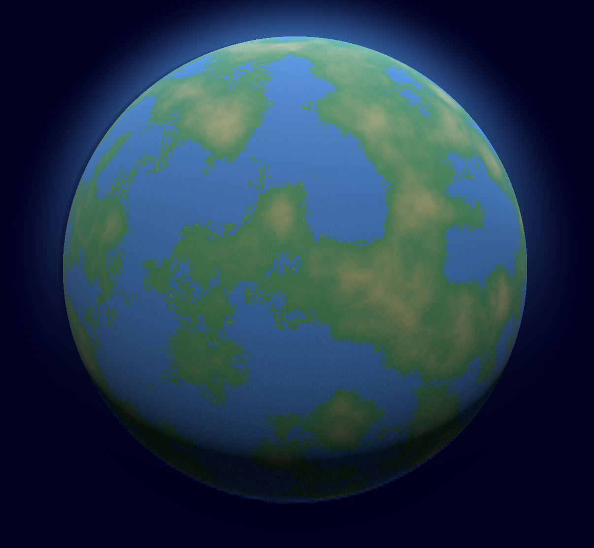

# Noterra – Procedural Planet + Volume Atmosphere

Interactive planet viewer built with Three.js. Features a procedural surface shader, volume-rendered atmosphere, smooth custom zoom, and free-orbit controls. Comes with Docker/Compose to serve the site anywhere (including Hostinger).

## Quick start
- Install deps: `npm install`
- Run dev server: `npm run dev` → http://localhost:4000

## Docker
- Build & run: `docker compose up --build`
- Default port: 4000 (map to 80 if needed: change to `"80:4000"` in docker-compose.yml)

## Controls (planet view)
- Drag: rotate freely (azimuth/polar unlocked)
- Scroll: smooth zoom to surface with exponential easing and min altitude guard
- Auto damping: enabled for softer motion

## Notable settings (PlanetApp.js)
- `minDistance` ~0.5, `maxDistance` 5
- Logarithmic depth buffer enabled on renderer
- Rotate speed scales down when close to the planet
- Shoreline detail kept in normals/color jitter without lifting highlands

## Project structure
- Planet view entry: `planet.html`, logic in `PlanetApp.js`
- Volume atmosphere: `VolumeRenderer.js` (+ `VolumeSamplers.js` helpers)
- Static server: `http-server` (see package.json scripts)
- Containerization: `Dockerfile`, `docker-compose.yml`

## Deploying (Hostinger or any Docker host)
1) Build image locally or with CI: `docker compose build`
2) Push image or copy repo to host
3) Run: `docker compose up -d` (map host port as desired)

## Attribution
- Three.js
- http-server
- Assets/code in this repo licensed under the repo LICENSE
